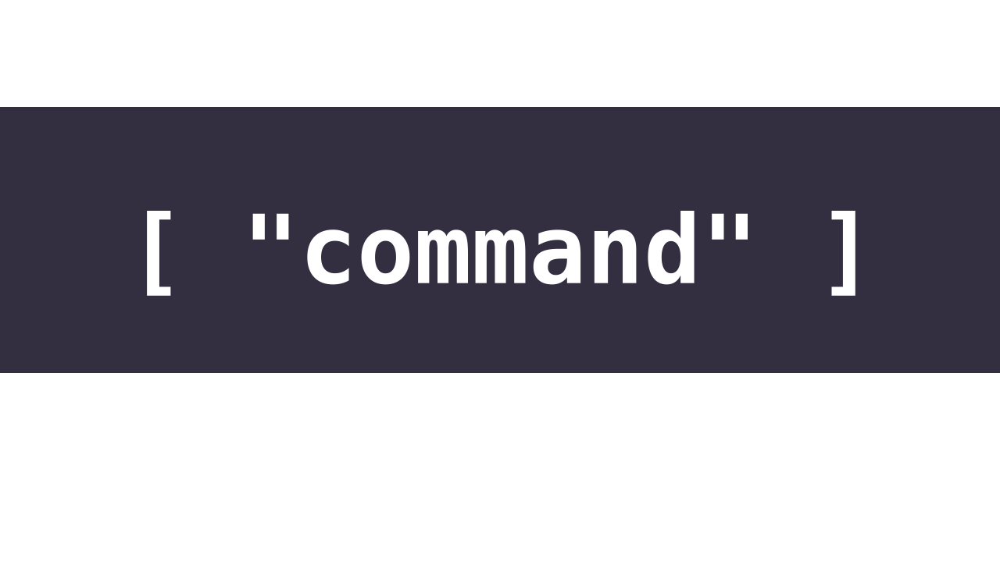

# CLArgumentsParser



Easy to use and setup parser of arguments from terminal for your command line tools.

## How to use

### 1. Setup available commands and options

```swift
typealias CustomCommand = BaseCLCommand<CustomOption, CustomCommandType>

enum CustomCommandType {
    case main
    case print
}

struct CustomOption: OptionType {

    static let help = MockOption(type: .help)

    enum CustomOptionType: String {
        case help

        var argumentsNeeded: (min: Int, max: Int) {
            switch self {
                default:
                    return (min: 0, max: 0)
            }
        }
    }
    
    var type: MockOptionType
    var arguments: [String] = []
    var argumentsNeeded: (min: Int, max: Int) { 
        type.argumentsNeeded
    }
    var stringValue: String {
        type.rawValue
    }
}
```

### 2. Register them

```swift
let registry = BaseCLRegister<CustomCommand>()


let mainCommand = CustomCommand(name: "main",
                                type: .main,
                                argumentsNeeded: (0, 2),
                                availableOptions: ["help": .help])

let helpCommand = CustomCommand(name: "help", type: .help)

let option = MockOption.help

registry.register(command: mainCommand)
registry.register(command: helpCommand)
registry.register(option: option)
```

### 3. Parse input

```swift
let parser = BaseCLParser<BaseCLRegister<CustomCommand>>(register: registry)

let arguments = CommandLine.arguments

let commands = try? parser.parse(arguments)
```

> For more details about usage you can chech test cases in *Tests/* folder.

## How to setup

You can app this package as a dependency to your application using SPM.

```swift
dependencies: [
    .package(url: "https://github.com/castlele/CLArgumentsParser.git", branch: "master"),
]
```
